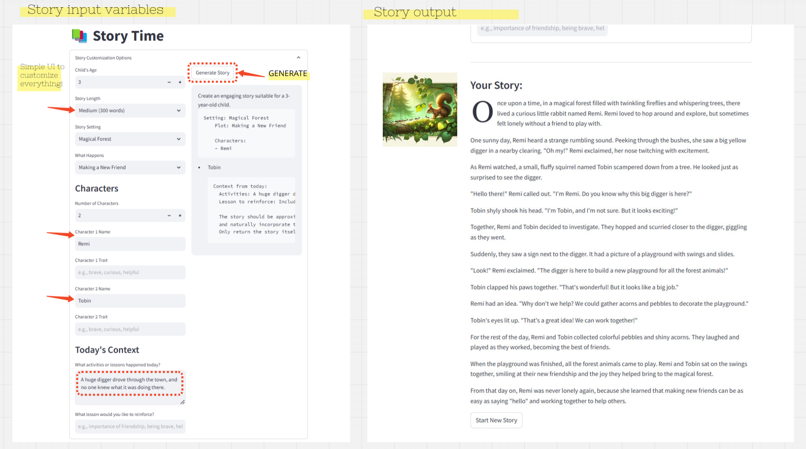

# DreamQuest
Childrens story generator with inputs for age, length, characters, themes and wholesome lessons.

  
   
  <em>DreamQuest Story Generator Interface</em>

## Things to do
0. Add more customisation with pre-filled inputs and generated suggested tags
    - Setting
    - What happens
    - Character {names}
    - How does it relate to today's activities, or lessons from the day?
1. Refactor all customisation fields into TOML file, include pre-fill suggestions
    AGE:
        3,4,5
    STORY_IDEAS:
        text: 
            "Leave blank for new generation"
        suggestions: 
            "Story about a little boy that loves construction vehicles"
            "Story about a little girl who sang a beautiful song"
    SETTING:
        suggestions:
            "In a fantasy magical kingdom not too different from our own, but with fascinating mysitcal powers."
    MORAL:
        "kindness"
        "sharing"
        "working hard"
1.1 (Optional)
    Click button to generate suggestions for each input

2. Make the story prompt more structured and maybe coloured for each parameter?
3. Make story prompt an editable text field?
4. Add "title" to story from LLM response
5. Add image icon from Dalle
6. What is this costing me?
7. Change colour theme based on story

## Installation

> git clone https://github.com/lukexyz/dreamquest.git  
> cd dreamquest

> conda create -n dreamquest python=3.11 pip jupyter  
> conda activate dreamquest  
> pip install -r requirements.txt  